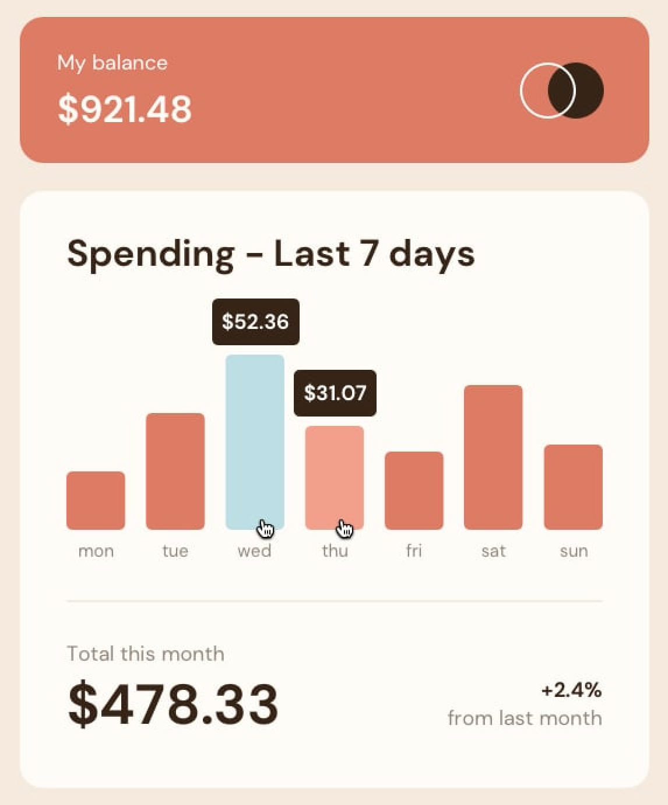
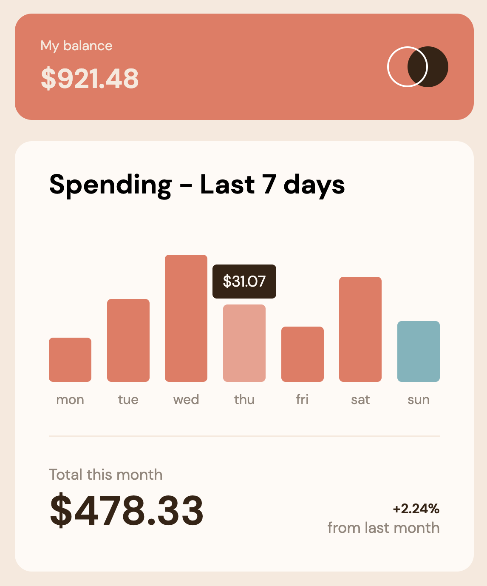

# Frontend Mentor - Expenses chart component solution

This is a solution to the [Expenses chart component challenge on Frontend Mentor](https://www.frontendmentor.io/challenges/expenses-chart-component-e7yJBUdjwt). Frontend Mentor challenges help you improve your coding skills by building realistic projects.

## Table of contents

- [Overview](#overview)
  - [The challenge](#the-challenge)
  - [Links](#links)
- [My process](#my-process)
  - [Built with](#built-with)
- [Author](#author)

## Overview

### The challenge

Users should be able to:

- View the bar chart and hover over the individual bars to see the correct amounts for each day
- See the current day’s bar highlighted in a different colour to the other bars
- View the optimal layout for the content depending on their device’s screen size
- See hover states for all interactive elements on the page
- **Bonus**: Use the JSON data file provided to dynamically size the bars on the chart

### Screenshot

Challenge

My solution

### Links

- Solution URL: (https://github.com/TheNewDevl/FE-Chal---expenses-chart-component)
- Live Site URL: (https://thenewdevl.github.io/FE-Chal---expenses-chart-component)

## My process

### Built with

- [React](https://reactjs.org/) - JS library
- JSX
- SASS
- Modern fluid typography

### What I learned

It was fun to practice fluid typography using clamp property.

### Continued development

Keep working on mobile first methods.

## Author

- GitHub - [Carl Dev](https://github.com/TheNewDevl)
- Frontend Mentor - [@TheNewDevl](https://www.frontendmentor.io/profile/TheNewDevl)
